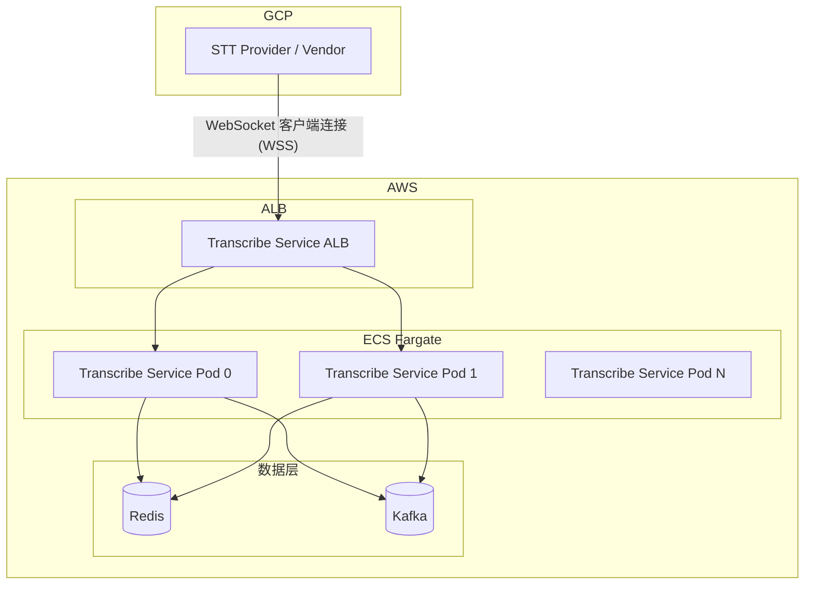
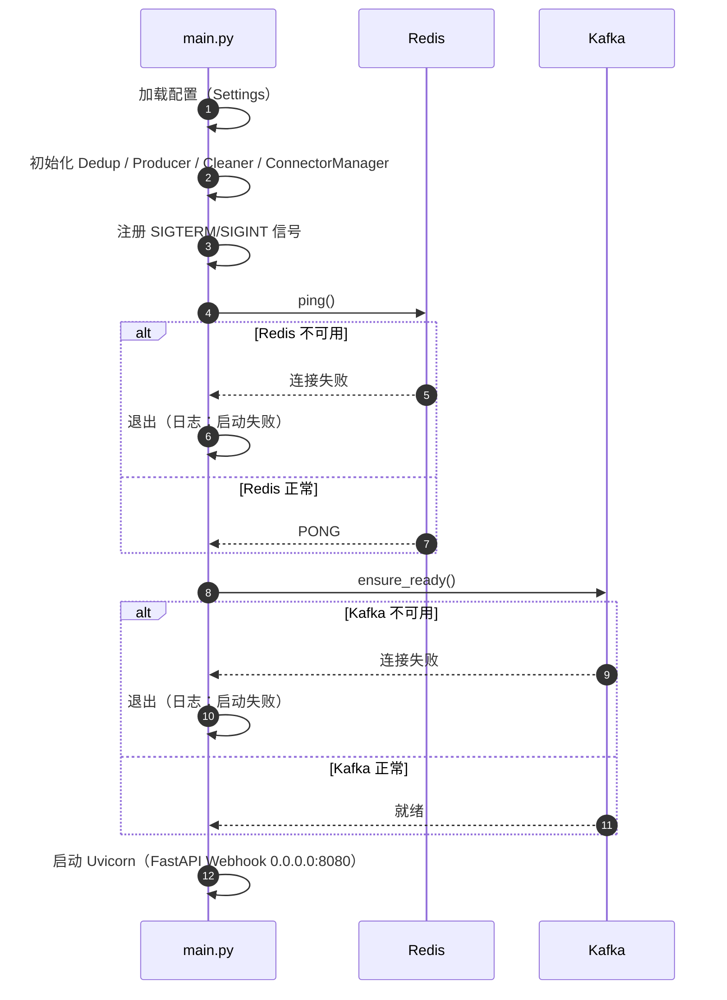
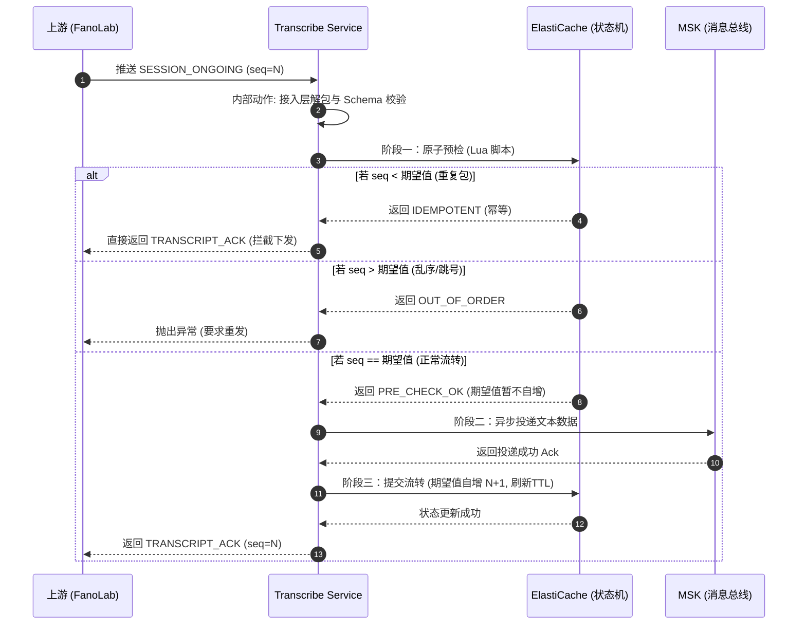
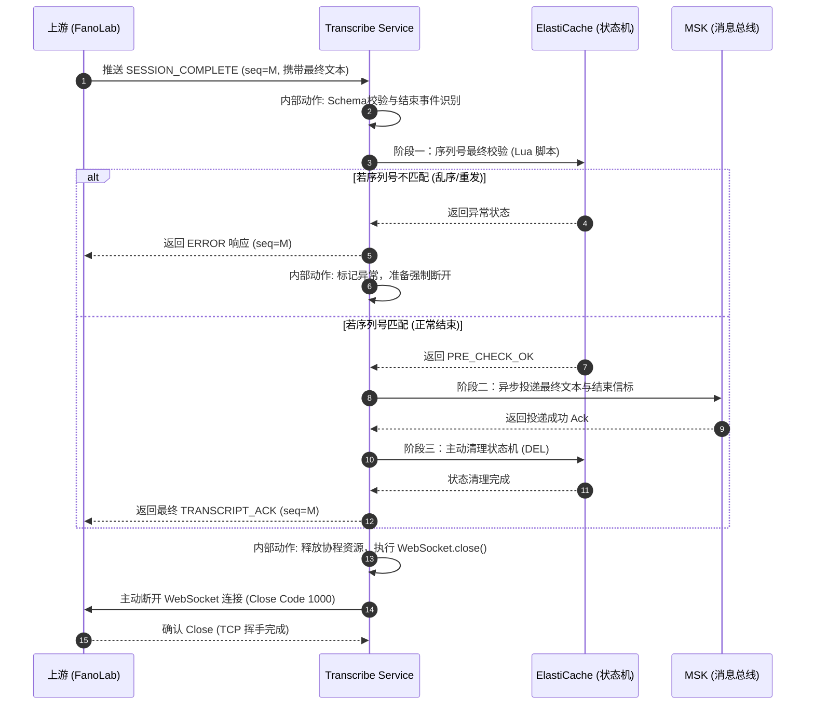
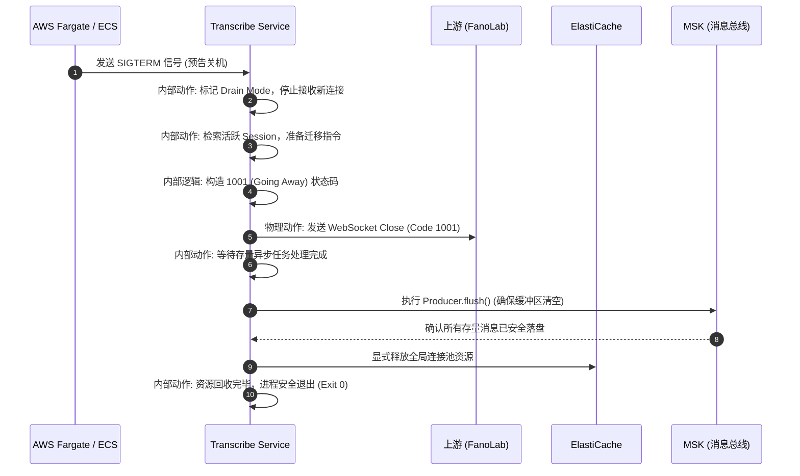

# Transcribe Service 设计总览

---

## 1. 设计总览

### 1.1 业务背景

在呼叫中心智能化升级背景下，本行引入了第三方厂商 FanoLab 的 ASR（自动语音识别）引擎。该引擎**由本行代为托管并部署于本行 GCP 环境中**，负责将客服通话语音实时转化为文本。

**Transcribe Service** 部署于本行 AWS 环境，作为连接 GCP 与 AWS 内部数据生态的**核心多云实时数据网关**。

### 1.2 业务目标


| 目标        | 指标                          |
| --------- | --------------------------- |
| **并发容量**  | 早高峰 700～1,000 路并发通话（设计目标）   |
| **端到端延迟** | < 50 ms（GCP 接收 → AWS Kafka） |
| **数据完整性** | 严格保序、零丢失                    |


### 1.3 职责边界


| 类型                    | 范围                                                    |
| --------------------- | ----------------------------------------------------- |
| **In-Scope（系统内）**     | 多云长连接管理；基于 sessionId/sequenceNumber 的保序校验；可靠投递至 Kafka |
| **Out-of-Scope（系统外）** | 不处理音频流；不包含意图识别、情感分析等业务逻辑；下游需自行订阅 Kafka                |


### 1.4 核心架构要点

- **连接模式**：STT Provider 作为 WebSocket 客户端，主动连接 Transcribe Service（服务端）
- **保序机制**：Redis 序列守卫（Lua 原子校验）+ 两阶段提交（2PC）
- **数据流**：Vendor → Transcribe Service → Kafka；下游以 Consumer Group 订阅消费

---

## 2. 架构总览

### 2.1 部署拓扑




### 2.2 核心时序图 (Core Sequence Diagrams)

#### 2.2.1 启动阶段 (Startup)




#### 2.2.2 业务流转 — 两阶段提交 (SESSION_ONGOING)




#### 2.2.3 SESSION_COMPLETE 事件处理与连接释放时序图




#### 2.2.4 系统优雅停机时序 (Graceful Shutdown Sequence)




---

## 3. 核心设计

### 3.1 角色与模块

应用内部采用**领域驱动设计（DDD）思想的依赖倒置架构**。核心业务编排器处于架构中心，所有的网络 I/O、协议解析与存储交互均被抽象为接口契约（Interface Contracts），实现模块间的绝对解耦。


| 核心模块 (Module)             | 核心职责与定位 (Role & Positioning) | 允许的核心动作 (Core Actions)                                                                          | 架构禁区 (Red Zone / Constraints)                                     |
| ------------------------- | ---------------------------- | ----------------------------------------------------------------------------------------------- | ----------------------------------------------------------------- |
| `main.py` *(主控入口)*        | 应用的起搏器与总指挥。管理应用生命周期与依赖注入。    | • 初始化外部连接池 (Redis/Kafka) • 实例化底层组件并注入到业务层 • 监听 `SIGTERM` 信号执行优雅停机                             | **绝对禁止**编写任何具体的业务判断逻辑或 JSON 解析代码。                                 |
| `schemas/` *(契约层)*        | 系统的护城河。基于 Pydantic 的强类型数据网关。 | • 过滤清洗 Vendor 发来的冗余脏字段 • 确保必填项 (`sessionId`, `seq`) 存在且类型正确 • 组装标准化的下行响应 Payload              | **绝对禁止**包含任何网络 I/O 或数据库调用。只做纯粹的 CPU 内存级数据校验。                      |
| `transport/` *(接入层)*      | 物理大门守卫。专职处理底层通信协议的脏活累活。      | • 管理 WebSocket 握手与 Token 鉴权 • 维持 20s Ping/Pong 心跳防 ALB 超时• 将底层异常转化为标准的协议 Close Code           | **绝对禁止**感知业务逻辑。只负责将收到的 JSON 抛给调度层，并将结果原封不动返回。                     |
| `state_machine/` *(状态机层)* | 分布式交警。维护通话级上下文，拦截乱序与重放攻击。    | • 执行基于 Lua 的原子预检与状态推进 • 维护 15 分钟滚动续租 (Rolling TTL) • 抛出统一且标准的业务状态转移异常                         | **绝对禁止**包含向 Kafka 发送消息或感知下游业务逻辑的代码。只管状态流转。                        |
| `producer/` *(投递层)*       | 可靠的快递员。将安全的数据投递到目标消息总线。      | • 处理 Kafka 异步写入与 Partition Hash 路由 • 实施 2s 超时快速失败机制 • 维护断路器 (Circuit Breaker) 熔断逻辑            | **绝对禁止**修改或篡改原始 Payload 数据。只做纯粹的搬运与状态反馈。                          |
| `orchestrator/` *(调度层)*   | 业务大脑。指挥各独立模块协同完成“两阶段提交”。     | • 调用 `state_machine` 预检并发锁 • 调用 `producer` 异步落盘 • 调用 `state_machine` 提交最终状态 • 组装并返回最终 ACK 结果 | **架构高压线**：绝对禁止直接 `import` 任何 `impl/` 下的具体实现类，只能依赖 `base.py` 抽象接口。 |


### 3.2 技术栈与并发模型


| 组件            | 选型                           |
| ------------- | ---------------------------- |
| **框架**        | FastAPI (ASGI) + Uvicorn     |
| **异步生态**      | redis.asyncio、aiokafka       |
| **并发模型**      | 单线程 Asyncio，每 vCPU 一个 Worker |
| **WebSocket** | websockets，`max_size=1MB`    |


**选型理由**：I/O 密集型场景；Asyncio 规避 GIL 与上下文切换开销；每 vCPU 一进程实现多核并行。

### 3.3 连接生命周期与保活


| 机制       | 配置                                   |
| -------- | ------------------------------------ |
| **业务信号** | `SESSION_ONGOING`、`SESSION_COMPLETE` |
| **协议保活** | 每 20 秒 Ping/Pong（ALB 空闲超时 60 秒）      |


### 3.4 状态机（乐观数据锁）

所有会话状态下沉 Redis，无本地会话状态。通过 Lua 脚本实现原子序列校验。


| **阶段**      | **操作**                          | **Redis 状态**        |
| ----------- | ------------------------------- | ------------------- |
| Prepare     | 收到 `seq=5`，预检通过（`current == 5`） | key 仍为 5，**不 INCR** |
| Persistence | 写入 Kafka，等待 Ack                 | key 仍为 5            |
| **Commit**  | **收到 Kafka Ack 后执行 INCR**       | key 从 5 → 6         |
| Ack         | 返回 TRANSCRIPT_ACK 给上游           | —                   |


#### 3.4.1 悲观锁 (SET NX) vs 乐观锁 (Lua + Seq)

##### 3.4.1.1 悲观锁 (Pessimistic Locking)

**核心逻辑**：通过加锁实现串行化访问，只有获得锁的进程才能进行处理，其他进程则等待锁释放。

###### 利与弊

- **利 (Pros)**：
  - **强一致性**：绝对不会出现数据竞争，因为同一时间只有一个 Worker 能处理这通电话。
  - **无需重试**：Worker 只要等到了锁，就一定能成功处理，不需要像乐观锁那样反复判断。
- **弊 (Cons)**：
  - **性能瓶颈**：每次处理 200ms 的语音片段都要“加锁 -> 处理 -> 释放锁”，Redis 的压力翻倍，延迟增加。
  - **死锁风险**：如果某个 Worker 拿到锁后卡住了（比如 ASR 引擎超时），锁没释放，这通电话的转写就彻底“断流”了。
  - **实时性差**：在高并发下，排队会导致严重的延迟累积，通话明明结束了，写入kafka的任务可能还在排队。

##### 3.4.1.2 乐观锁 (Optimistic Locking)

**核心逻辑**：各处理方并行处理数据，提交时通过比对序号决定有效性，序号较小或迟到的数据会被丢弃。

###### 利与弊

- **利 (Pros)**：
  - **极低延迟**：不阻塞，不排队。利用 Lua 脚本原子性判断，速度极快。
  - **高吞吐**：适合“读多写少”或“高频写入”场景。对于 Redis 来说，只是一个简单的数值比对。
  - **天然去重**：由于它基于 `sequence` 比对，能自动把重复发送的、乱序迟到的包挡在门外。
- **弊 (Cons)**：
  - **数据丢失（策略性）**：为了保序，它会主动丢弃“迟到”的包（比如 Seq 10 比 Seq 11 晚到，10 就会被丢弃）。
  - **客户端实现相对复杂**：在本场景可直接丢弃迟到包，但在某些应用场景下，可能需额外设计重试与补偿机制。


| **维度**     | **悲观锁 (SET NX)** | **乐观锁 (Lua + Seq)** | **Transcribe Service 推荐** |
| ---------- | ---------------- | ------------------- | ------------------------- |
| **并发冲突频率** | 高冲突，必须成功         | 允许部分失效，追求快          | **乐观锁**                   |
| **系统响应要求** | 毫秒级不敏感           | **极度敏感（实时通话）**      | **乐观锁**                   |
| **异常处理**   | 担心死锁/清理锁         | 担心重复/乱序             | **乐观锁**                   |
| **核心关注点**  | 数据的“绝对完整”        | 消息的“时序与去重”          | **乐观锁**                   |


### 3.5 两阶段提交（2PC）

系统不使用分布式事务，而是通过“状态滞后推进”实现一致性：

1. **Prepare**: FanoAssist 发送 `seq=5`。Transcribe Service 调用 Lua 预检。
2. **Persistence**: 写入 Kafka。设置 `acks=all`。
3. **Commit**: 收到 Kafka Ack。调用 Redis `INCR` 脚本将期望值推至 6。
4. **Ack**: 回复 `TRANSCRIPT_ACK`。
5. **异常处理**：若 Kafka 写入失败，不执行第 3 步。上游超时后重发 `seq=5`，Redis 此时存的仍是 5，预检依然通过，实现无损重试。


| 阶段                   | 操作                                    |
| -------------------- | ------------------------------------- |
| **Prepare（预检）**      | Lua 预检（不自增）                           |
| **Persistence（持久化）** | 写入 Kafka，`sessionId` 为 Key，`acks=all` |
| **Commit（提交）**       | Kafka Ack 后调用 Redis INCR              |
| **Ack**              | 发送 `TRANSCRIPT_ACK`                   |


### 3.6 容器漂移与优雅停机 (Graceful Shutdown)

在 ECS Fargate 触发版本发布或缩容时，系统必须平滑处理正在处理中的长连接。

- 接收到容器编排发出的 `SIGTERM` 信号后，Transcribe Service 立即停止接收新连接。
- 对存量 WebSocket 连接主动发送特定的 Close 帧（如 Code 1001/1012），通知对端暂停发送并准备重连至新节点。
- 阻塞主进程退出，直至内存缓冲区中已校验的最后几条记录安全落盘至 Kafka，确保应用漂移期间的绝对零数据丢失。


| 步骤  | 动作                         |
| --- | -------------------------- |
| 1   | 收到 SIGTERM 后停止接收新连接        |
| 2   | 向存量连接发送 Close 帧（1001/1012） |
| 3   | Flush Kafka 生产者缓冲区         |
| 4   | 待飞行中消息落盘后退出                |


---

## 4. 基础设施与容量

### 4.1 Kafka


| 项目                | 配置                                                     |
| ----------------- | ------------------------------------------------------ |
| **Topic**         | `cc.transcript.realtime.v1`                            |
| **Partition Key** | `sessionId`                                            |
| **Partition 数量**  | 定死 50 或 100（Hash 基数不可变）                                |
| **可靠性**           | `acks=all`、`enable_idempotence=True`、`max_in_flight=1` |
| **压缩**            | `zstd`                                                 |
| **保留期**           | 7 天                                                    |
| **MSK**           | `min.insync.replicas=2`                                |


**消息结构（JSON/Protobuf）：**

```json
TBD
```

### 4.2 Redis

#### 4.2.1 悲观锁 (SET NX) vs 乐观锁 (Lua + Seq)

##### 4.2.1.1 悲观锁 (Pessimistic Locking)

**核心逻辑**：通过加锁实现串行化访问，只有获得锁的进程才能进行处理，其他进程则等待锁释放。

###### 利与弊

- **利 (Pros)**：
  - **强一致性**：绝对不会出现数据竞争，因为同一时间只有一个 Worker 能处理这通电话。
  - **无需重试**：Worker 只要等到了锁，就一定能成功处理，不需要像乐观锁那样反复判断。
- **弊 (Cons)**：
  - **性能瓶颈**：每次处理 200ms 的语音片段都要“加锁 -> 处理 -> 释放锁”，Redis 的压力翻倍，延迟增加。
  - **死锁风险**：如果某个 Worker 拿到锁后卡住了（比如 ASR 引擎超时），锁没释放，这通电话的转写就彻底“断流”了。
  - **实时性差**：在高并发下，排队会导致严重的延迟累积，通话明明结束了，写入kafka的任务可能还在排队。

##### 4.2.1.2 乐观锁 (Optimistic Locking)

**核心逻辑**：各处理方并行处理数据，提交时通过比对序号决定有效性，序号较小或迟到的数据会被丢弃。

###### 利与弊

- **利 (Pros)**：
  - **极低延迟**：不阻塞，不排队。利用 Lua 脚本原子性判断，速度极快。
  - **高吞吐**：适合“读多写少”或“高频写入”场景。对于 Redis 来说，只是一个简单的数值比对。
  - **天然去重**：由于它基于 `sequence` 比对，能自动把重复发送的、乱序迟到的包挡在门外。
- **弊 (Cons)**：
  - **数据丢失（策略性）**：为了保序，它会主动丢弃“迟到”的包（比如 Seq 10 比 Seq 11 晚到，10 就会被丢弃）。
  - **客户端实现相对复杂**：在本场景可直接丢弃迟到包，但在某些应用场景下，可能需额外设计重试与补偿机制。


| **维度**     | **悲观锁 (SET NX)** | **乐观锁 (Lua + Seq)** | **Transcribe Service 推荐** |
| ---------- | ---------------- | ------------------- | ------------------------- |
| **并发冲突频率** | 高冲突，必须成功         | 允许部分失效，追求快          | **乐观锁**                   |
| **系统响应要求** | 毫秒级不敏感           | **极度敏感（实时通话）**      | **乐观锁**                   |
| **异常处理**   | 担心死锁/清理锁         | 担心重复/乱序             | **乐观锁**                   |
| **核心关注点**  | 数据的“绝对完整”        | 消息的“时序与去重”          | **乐观锁**                   |


#### 4.2.2 Redis配置


| 项目        | 配置                                                                  | 说明                                                                                          |
| --------- | ------------------------------------------------------------------- | ------------------------------------------------------------------------------------------- |
| **Key**   | `transcript:session:{sessionId}`                                    | 用于标识每个会话在 Redis 中的唯一进度 Key。                                                                 |
| **Value** | 整数（期望下一个序号），或 Hash（包含 `expected_seq`、`start_time`、`last_active` 字段） | 保存该通话下一条应接收的 transcript 序号及元信息。                                                             |
| **更新策略**  | Lua 脚本（乐观锁）                                                         | 仅允许传入的序列号严格递增，确保乱序或重复的数据自动被丢弃。                                                              |
| **TTL**   | 活跃阶段：顺序每次写入自动续期 1 小时；结束阶段：写入 is_final 或 WebSocket 断开时缩短为 30-60 秒    | - 会话进行中，TTL 每次写入自动延长至 1 小时，防止异常断线占用内存。 - 通话结束（is_final/断开），TTL 降为 30-60 秒，阻挡迟到包，之后自动删除释放空间。 |
| **内存**    | 约 100B/会话，1,000 会话 < 1MB                                            | 不立即删除 Key，留短暂宽限以兜住网络延迟下的迟到 transcript，防止数据重复或乱序写入。                                          |


---

## 附录 A — API 契约完整规格
> **完整 API 契约请参见**：[Transcribe Service API Contract 契约文档](transcribe-service-API-contract.md)


